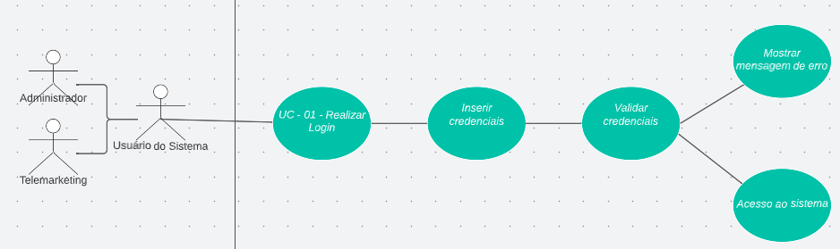

<h1> UC01 - Realizar Login </h1>

<h2><strong>Diagrama</strong></h2>

<h2><strong>Descrição</strong></h2>
O usuário deve poder realizar login no sistema

<h2><strong>Atores</strong></h2>
Administrador e Telemarketing

<h2><strong>Pré-requisitos</strong></h2>
O usuário deve ser cadastrado no sistema

<h2><strong>Fluxo de Eventos</strong></h2>
<h3>Fluxo Principal</h3>
- O usuário do sistema deve acessar a página de login.
    
- O usuário do sistema deve inserir suas credenciais (CPF e senha).
    
- O usuário do sistema deve clicar em “Entrar”.
    
- O sistema valida as credenciais do usuário.
    
- O usuário passa a estar logado.

<h3>Fluxo Alternativo</h3>
- Não há fluxos alternativos.
<h3>Fluxo de Exceção</h3>
FE01: As credenciais do usuário não se enquadram com nenhuma cadastrada

- O usuário do sistema deve acessar a página de login.
- O usuário do sistema deve inserir suas credenciais (CPF e senha).
- O usuário do sistema deve clicar em “Entrar”.
- O sistema tenta validar as credenciais do usuário.
- O sistema apresenta ERRO nas credenciais e não permite o login.

<h2><strong>Pós-condição</strong></h2>
O usuário passa a ter acesso às funcionalidades que o seu nível de acesso permite.
<h2><strong>Referências</strong></h2>
[MVP](mvp.md)
<h2><strong>Versionamento</strong></h2>
| Data       | Versão | Descrição                           | Autor                                                                                                       |
| ---------- | ------ | ----------------------------------- | ----------------------------------------------------------------------------------------------------------- |
| 31/08/2022 | 1.0    | Criação do caso de uso                    | [Carlos Eduardo](https://github.com/CaduRoriz) [Augusto](https://github.com/augustocrmg) |
| 31/08/2022 | 1.0    | Revisão do caso de uso                    | [André](https://github.com/dartmol203) |   
| 07/08/2022 | 1.1    | Inclusão do caso de uso no documento                    | [Carlos Eduardo](https://github.com/CaduRoriz) |  