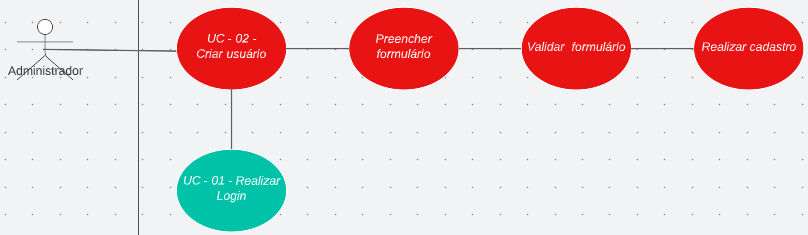

<h1> UC02 - Criar Usuário </h1>

<h2><strong>Diagrama</strong></h2>

<h2><strong>Descrição</strong></h2>
O usuário deve poder cadastrar um usuário no sistema

<h2><strong>Atores</strong></h2>
Administrador

<h2><strong>Pré-requisitos</strong></h2>
O usuário criador deve estar logado e o usuário a ser cadastrado deve possuir credenciais ainda não utilizadas

<h2><strong>Fluxo de Eventos</strong></h2>
<h3>Fluxo Principal</h3>
- O administrador deve estar na página de Gerenciar Usuários.
- O administrador deve selecionar a opção "Criar Usuário".
- O administrador deve preencher o formulário com os dados do usuário a ser cadastrado ( CPF, nome, senha).
- O sistema deve validar as informações inseridas.
- Os sistema deve aprova o cadastro.

<h3>Fluxo Alternativo</h3>
- Não há fluxos alternativos.
<h3>Fluxo de Exceção</h3>
FE02: As credenciais de cadastro não são adequadas ou já constam no banco.

- O administrador deve estar na página de Gerenciar Usuários.
- O administrador deve selecionar a opção "Criar Usuário".
- O administrador deve preencher o formulário com os dados do usuário a ser cadastrado ( CPF, nome, senha).
- O sistema deve validar as informações inseridas.
- Os sistema recusa o cadastro.

<h2><strong>Pós-condição</strong></h2>
O usuário criado deve ser possível de realizar login de acordo com o [UC01](UC01.md)
<h2><strong>Referências</strong></h2>
[MVP](mvp.md)
<h2><strong>Versionamento</strong></h2>
| Data       | Versão | Descrição                            | Autor                                                                                    |
| ---------- | ------ | ------------------------------------ | ---------------------------------------------------------------------------------------- |
| 31/08/2022 | 1.0    | Criação do caso de uso               | [Carlos Eduardo](https://github.com/CaduRoriz) [Augusto](https://github.com/augustocrmg) |
| 31/08/2022 | 1.0    | Revisão do caso de uso               | [André](https://github.com/dartmol203)                                                   |
| 07/08/2022 | 1.1    | Inclusão do caso de uso no documento | [Carlos Eduardo](https://github.com/CaduRoriz)                                           |