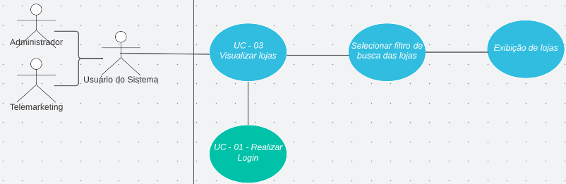

<h1> UC03 - Visualizar Lojas </h1>

<h2><strong>Diagrama</strong></h2>

<h2><strong>Descrição</strong></h2>
O usuário deve poder visualizar as lojas.

<h2><strong>Atores</strong></h2>
Administrador e Telemarketing

<h2><strong>Pré-requisitos</strong></h2>
O usuário deve estar logado na aplicação e deve conter lojas no sistema. 

<h2><strong>Fluxo de Eventos</strong></h2>
<h3>Fluxo Principal</h3>
- O usuário do sistema deve estar na página inicial.
- O usuário do sistema deve clicar em "Filtro de Busca".
- O usuário do sistema deve selecionar o tipo de filtro para a busca.
- O usuário do sistema deve clicar em "Buscar".
- O sistema deve exibir as lojas de acordo com o filtro escolhido.

<h3>Fluxo Alternativo</h3>
- Não há fluxos alternativos.

<h2><strong>Pós-condição</strong></h2>
Uma lista de lojas deve ser visível para o usuário que solicitou
<h2><strong>Referências</strong></h2>
[MVP](mvp.md)
<h2><strong>Versionamento</strong></h2>
| Data       | Versão | Descrição                           | Autor                                                                                                       |
| ---------- | ------ | ----------------------------------- | ----------------------------------------------------------------------------------------------------------- |
| 31/08/2022 | 1.0    | Criação do caso de uso                    | [Carlos Eduardo](https://github.com/CaduRoriz) [Augusto](https://github.com/augustocrmg) |
| 31/08/2022 | 1.0    | Revisão do caso de uso                    | [André](https://github.com/dartmol203) |   
| 07/08/2022 | 1.1    | Inclusão do caso de uso no documento                    | [Carlos Eduardo](https://github.com/CaduRoriz) |  