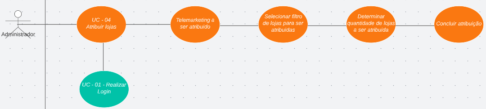

<h1> UC04 - Atribuir Lojas </h1>

<h2><strong>Diagrama</strong></h2>

<h2><strong>Descrição</strong></h2>
O usuário deve poder atribuir lojas para outros usuários

<h2><strong>Atores</strong></h2>
Administrador

<h2><strong>Pré-requisitos</strong></h2>
O usuário deve estar logado na aplicação e deve haver lojas a serem atribuidas no sistema. 

<h2><strong>Fluxo de Eventos</strong></h2>
<h3>Fluxo Principal</h3>
- O administrador deve estar na página de atribuição de lojas.
- O administrador deve selecionar o(s) atendente(s) de telemarketing que deseja atribuir as lojas.
- O administrador deve selecionar o filtro de lojas que deseja atribur.
- O administrador deve selecionar a quantidade de lojas que deverão ser atribuídas.
- O sistema deve atribuir as lojas exibidas pelo filtro ao(s) atendentes de telemarketing selecionado(s) OU mostrar ERRO caso não haja lojas o suficiente.

<h3>Fluxo Alternativo</h3>
- Não há fluxos alternativos.

<h2><strong>Pós-condição</strong></h2>
As lojas atribuidas devem estar ligadas a um usuário de telemarketing, cada telemarketing pode ter 0 ou mais lojas ligadas.
<h2><strong>Referências</strong></h2>
[MVP](mvp.md)
<h2><strong>Versionamento</strong></h2>
| Data       | Versão | Descrição                           | Autor                                                                                                       |
| ---------- | ------ | ----------------------------------- | ----------------------------------------------------------------------------------------------------------- |
| 31/08/2022 | 1.0    | Criação do caso de uso                    | [Carlos Eduardo](https://github.com/CaduRoriz) [Augusto](https://github.com/augustocrmg) |
| 31/08/2022 | 1.0    | Revisão do caso de uso                    | [André](https://github.com/dartmol203) |   
| 07/08/2022 | 1.1    | Inclusão do caso de uso no documento                    | [Carlos Eduardo](https://github.com/CaduRoriz) |  