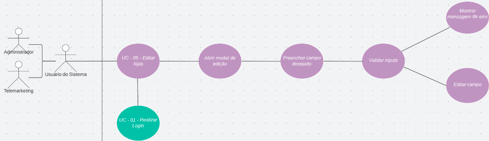

<h1> UC05 - Editar Lojas </h1>

<h2><strong>Diagrama</strong></h2>

<h2><strong>Descrição</strong></h2>
O usuário deve poder editar dados das lojas.

<h2><strong>Atores</strong></h2>
Administrador e Telemarketing

<h2><strong>Pré-requisitos</strong></h2>
O usuário deve estar logado na aplicação e deve haver lojas no sistemas para poderem ser eidtadas.

<h2><strong>Fluxo de Eventos</strong></h2>
<h3>Fluxo Principal</h3>
- O usuário do sistema deve estar na página de visualizar lojas.
- O usuário do sistema deve selecionar a opção "Editar Lojas".
- O sistema deve abrir a janela de edição.
- O usuário do sistema deve preencher/alterar o(s) campo(s) desejado(s).
- O sistema deve validar as entradas/alterações.
- O sistema deve aprovar a edição ou mostrar uma mensagem de erro.

<h3>Fluxo Alternativo</h3>
- Não há fluxos alternativos.

<h2><strong>Pós-condição</strong></h2>
As informações que foram alteradas devem ficar salvas para que o próximo usuário a ver esses dados esteja em dia com os dados.
<h2><strong>Referências</strong></h2>
[MVP](mvp.md)
<h2><strong>Versionamento</strong></h2>
| Data       | Versão | Descrição                           | Autor                                                                                                       |
| ---------- | ------ | ----------------------------------- | ----------------------------------------------------------------------------------------------------------- |
| 31/08/2022 | 1.0    | Criação do caso de uso                    | [Carlos Eduardo](https://github.com/CaduRoriz) [Augusto](https://github.com/augustocrmg) |
| 31/08/2022 | 1.0    | Revisão do caso de uso                    | [André](https://github.com/dartmol203) |   
| 07/08/2022 | 1.1    | Inclusão do caso de uso no documento                    | [Carlos Eduardo](https://github.com/CaduRoriz) |  