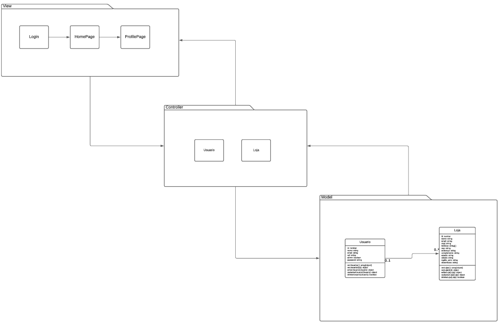

## Arquitetura do sistema

 O sistema foi pensado de forma a ser construido em uma arquitetura MVC (Model, View e Controller), e o modelo está descrito no diagrama a baixo (ainda possivel de ser atualizado diante de quaisquer necessidades): 

**Histórico de Versões**

| Data       | Versão | Descrição      | Autor                                         |
| ---------- | ------ | -------------- | --------------------------------------------- |
| 18/08/2022 | 0.1    | Versão inicial | [André Corrêa](https://github.com/dartmol203) |