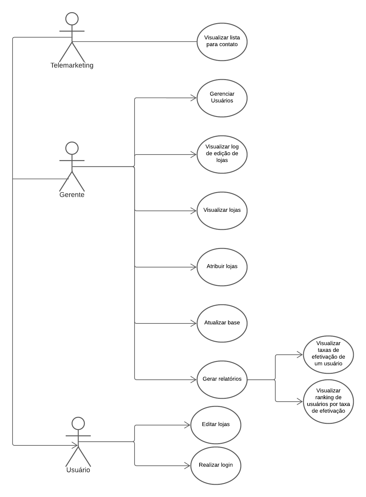

# Diagrama de Casos de Uso

[Lucid Chart](https://lucid.app/lucidchart/139ab2cf-fc08-42e9-99c0-7d3bd246e44b/edit?view_items=R9LO7lKaSwDE&invitationId=inv_7a6ff4dc-3726-4603-847b-a66e176e85ec#)

##Especificação do diagrama

[Lucid Chart](https://lucid.app/lucidspark/e767608c-aba0-4eaf-abfd-e32394a0f6b2/edit?viewport_loc=1263%2C3450%2C6400%2C3230%2C0_0&invitationId=inv_87005254-4c4f-4e39-9ced-8d818a77aa89#)

| Data       | Versão | Descrição      | Autor                                                                                       |
| ---------- | ------ | -------------- | ------------------------------------------------------------------------------------------- |
| 06/09/2022 | 0.1    | Versão inicial | [André Corrêa](https://github.com/dartmol203) e [Gabriel Luiz](https://github.com/ggomesbr) |