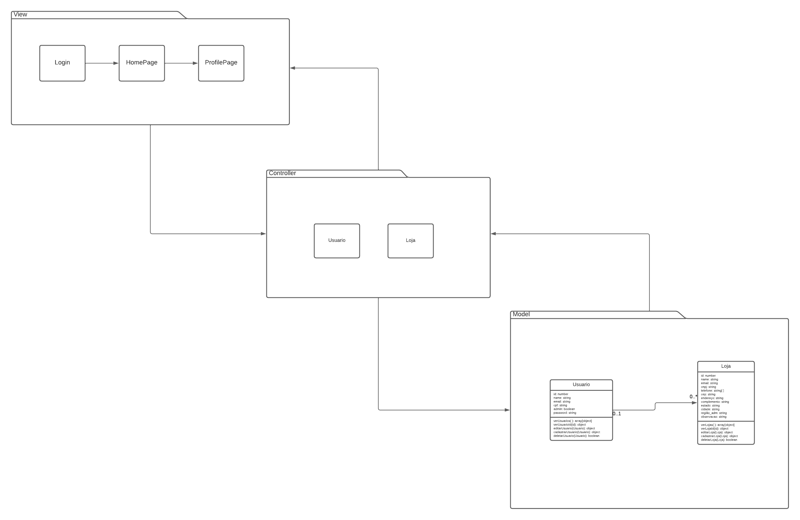

## Diagrama de Classes

 O diagram de classes está sendo desenvolvido pelo LucidChart 

[Link para o Lucid](https://lucid.app/lucidchart/20d99b02-08d9-4f96-8b6b-4ced3e10ab7b/edit?invitationId=inv_f52a7eb6-ab47-467c-8fd6-aa79fa5942c0&page=0_0#)

**Histórico de Versões**

| Data       | Versão | Descrição      | Autor                                                                                 |
| ---------- | ------ | -------------- | ------------------------------------------------------------------------------------- |
| 18/08/2022 | 0.1    | Versão inicial | [Carlos Eduardo Mendes de Mesquita](https://github.com/CarlosEduardoMendesdeMesquita) |
| 18/08/2022 | 0.2    | Atualiza img   | [Alexia Naara](https://github.com/alexianaa)                                          |
