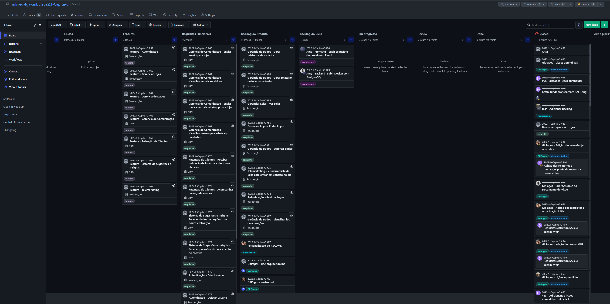

## Entrega 1
[Vídeo de apresentação da Visão do Produto e Projeto](https://drive.google.com/file/d/1eL-pX9ZtqTw1kxzvs4oMRPZgEVu55U2g/view?usp=sharing)

[Documento de visão](visao.md)

[Organização do Projeto](org_proj.md)

[Método de desenvolvimento](ciclos.md)

[Riscos](riscos.md)

[Lições aprendidas](licoes_aprendidas.md)

## Entrega 2
----------
### Requisitos de Software

[Vídeo de apresentação da entrega da Unidade 2](https://https://drive.google.com/file/d/1eL-pX9ZtqTw1kxeqhgj2W4x3wrRPZg4wqeVu55t22g/view?usp=sharing)

#### Quadro Kanbam

Disponível no zenhub do repositório.

----------

### [Métodos de Desenvolvimento de Software](dojo.md)

<!-- por favor, criem uma outra página específica para esse material. Deixem aqui, apenas os vídeos.
outra supgestão: coloquem aqui, os links das outras páginas onde as entregas estão detalhadas. Ou seja: entrega 1: link para o Visão, etc,. Entrega 2: link para esse material, etc.. -->
 

## Entrega 3

[Documento de visão](visao.md)

[Organização do Projeto](org_proj.md)

[Método de desenvolvimento e processos](ciclos.md)

[Riscos](riscos.md)

[Lições aprendidas](licoes_aprendidas.md)

[Arquitetura](arquitetura.md)

[Protótipos](prototipos.md)

**Histórico de Versões**

| Data       | Versão | Descrição                       | Autor                                                         |
| ---------- | ------ | ------------------------------- | ------------------------------------------------------------- |
| 05/07/2022 | 0.1    | Entrega 1                       | [Arthur Ferreira](https://github.com/ArthurFerreiraRodrigues) |
| 19/07/2022 | 0.1.1  | Adicionando Tópico da Entrega 2 | [Arthur Ferreira](https://github.com/ArthurFerreiraRodrigues) |
| 19/07/2022 | 0.2    | Entrega 2 - MDS                 | [Alexia Naara](https://github.com/alexianaa)                  |
| 02/08/2022 | 0.2.1  | Entrega 2 - correção de links   | [Alexia Naara](https://github.com/alexianaa)                  |
| 18/08/2022 | 0.3    | Adição tópico entrega 3         | [André Corrêa](https://github.com/dartmol203)                 |
