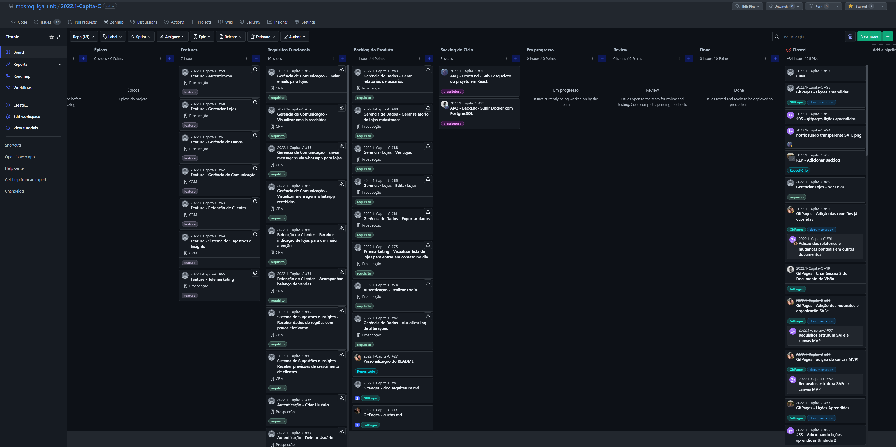

# Entregas Requisitos de Software

## Entrega 1
[Vídeo de apresentação da Visão do Produto e Projeto](https://drive.google.com/file/d/1eL-pX9ZtqTw1kxzvs4oMRPZgEVu55U2g/view?usp=sharing)

[Documento de visão](visao.md)

[Organização do Projeto](org_proj.md)

[Método de desenvolvimento](ciclos.md)

[Riscos](riscos.md)

[Lições aprendidas](licoes_aprendidas.md)

## Entrega 2

[Vídeo de apresentação da entrega da Unidade 2](https://https://drive.google.com/file/d/1eL-pX9ZtqTw1kxeqhgj2W4x3wrRPZg4wqeVu55t22g/view?usp=sharing)

#### Quadro Kanbam

Disponível no zenhub do repositório.

**Histórico de Versões**

| Data       | Versão | Descrição                       | Autor                                                         |
| ---------- | ------ | ------------------------------- | ------------------------------------------------------------- |
| 05/07/2022 | 0.1    | Entrega 1                       | [Arthur Ferreira](https://github.com/ArthurFerreiraRodrigues) |
| 19/07/2022 | 0.1.1  | Adicionando Tópico da Entrega 2 | [Arthur Ferreira](https://github.com/ArthurFerreiraRodrigues) |
