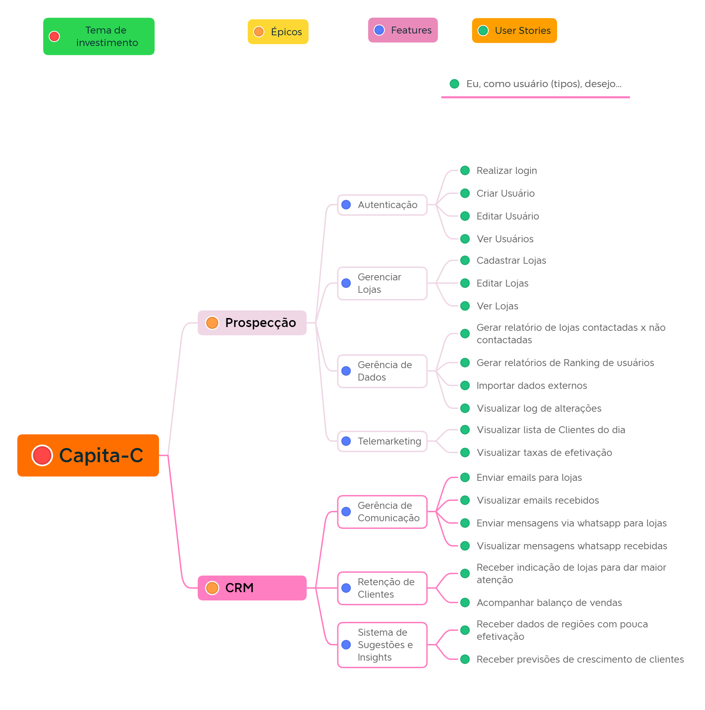

# Requisitos

## Requisitos Funcionais

### Prospecção

#### Autenticação

<ul>
<li>
  
RF1 - Realizar login;

</li>

</ul>

#### Gerenciar Sistema

<ul>
<li>
  
RF2 - Criar Usuário;

</li>

<li>
  
RF3 - Editar Usuário;

</li>

<li>
  
RF4 - Ver Usuário;

</li>
</ul>

#### Gerenciar Lojas

<ul>
<li>
  
RF5 - Cadastrar Lojas;

</li>

<li>
  
RF6 - Editar Lojas;

</li>

<li>
  
RF7 - Ver Lojas;

</li>

<li>
  
RF8 - Atribuir lojas a atendente de telemarketing;

</li>

</ul>

#### Gerência de Dados

<ul>
<li>
  
RF9 - Gerar relatório de lojas cadastradas;

</li>

<li>
  
RF10 - Gerar relatórios de usuários;

</li>

<li>
  
RF11 - Importar dados de bases externas;

</li>

<li>
  
RF12 - Visualizar log de alterações realizadas no cadastro de uma loja;

</li>
</ul>

#### Telemarketing

<ul>
<li>
  
RF13 - Visualizar lista de lojas para entrar em contato no dia;

</li>

<li>
  
RF14 - Visualizar taxas de efetivação;

</li>
</ul>

### CRM

#### Gerência de Comunicação

<ul>
<li>
  
RF15 - Enviar emails para lojas;

</li>

<li>
  
RF16 - Visualizar emails recebidos;

</li>

<li>
  
RF17 - Enviar mensagens via whatsapp para lojas;

</li>

<li>
  
RF18 - Visualizar mensagens whatsapp recebidas;

</li>
</ul>

#### Retenção de Clientes

<ul>
<li>
  
RF19 - Receber indicação de lojas para dar maior atenção;

</li>

<li>
  
RF20 - Acompanhar balanço de vendas;

</li>
</ul>

#### Sistema de Sugestões e Insights

<ul>
<li>
  
RF21 - Receber dados de regiões com pouca efetivação;

</li>

<li>
  
RF22 - Receber previsões de crescimento de clientes;

</li>

</ul>

## Requisitos Não Funcionais

<ul>
<li>
  
RNF1 - Acessar CNPJs por uma base pública, atualizada periódicamente;

</li>

<li>
  
RNF2 - Aplicação WEB;

</li>

<li>
  
RNF3 - Sistema não intranet;

</li>

<li>
  
RNF4 - Deve ser desenvolvido em TypeScript com ReactJS (front-end);

</li>

<li>
  
RNF5 - Deve ser desenvolvido em TypeScript com NodeJS (back-end);

</li>

<li>
  
RNF6 - Deve ser utilizado o PostgreSQL como banco de dados;

</li>

<li>
  
RNF7 - Deve ser utilizado o GitHub para o controle de versionamento;

</li>

<li>
  
RNF8 - Tempo de acesso e contato com o possível cliente deve ser inferior a 5 minutos, para um novo usuário.

</li>
</ul>

## Backlog do produto (SAFe)

**Histórico de Versões**

| Data       | Versão | Descrição                                     | Autor                                                                                       |
| ---------- | ------ | --------------------------------------------- | ------------------------------------------------------------------------------------------- |
| 19/07/2022 | 0.1    | Versão inicial                                | [Gabriel Luiz](https://github.com/ggomesbr) e [André Corrêa](https://github.com/dartmol203) |
| 20/07/2022 | 0.2    | Adição da imagem e atualização nos requisitos | [André Corrêa](https://github.com/dartmol203)                                               |
| 21/07/2022 | 0.2.1  | hotfix imagem fundo transparente              | [André Corrêa](https://github.com/dartmol203)                                               |
| 18/08/2022 | 0.3    | adição de requito e correção na numeração     | [André Corrêa](https://github.com/dartmol203)                                               |