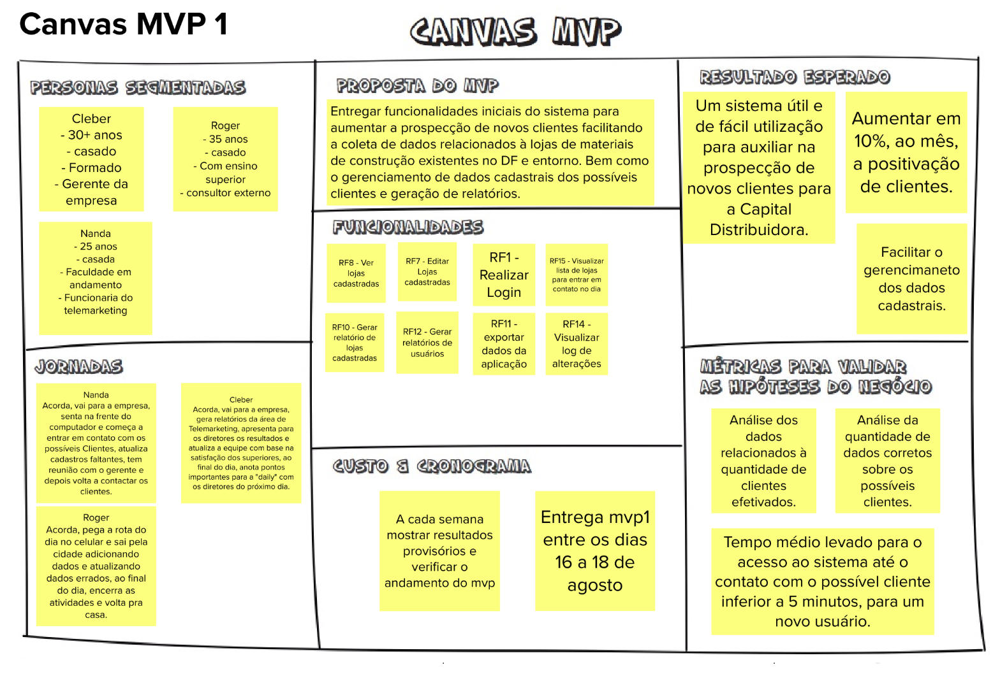

# MVP do projeto

MVP (Minimum Viable Product) é um conjunto que funcionalidades que vão ser implementadas nos próximos ciclos, essas que são escolhidas com base no maior valor de negócio para o cliente. 

**Histórico de Versões**

| Data       | Versão | Descrição      | Autor                                         |
| ---------- | ------ | -------------- | --------------------------------------------- |
| 20/07/2022 | 0.1    | Versão inicial | [André Corrêa](https://github.com/dartmol203) |
