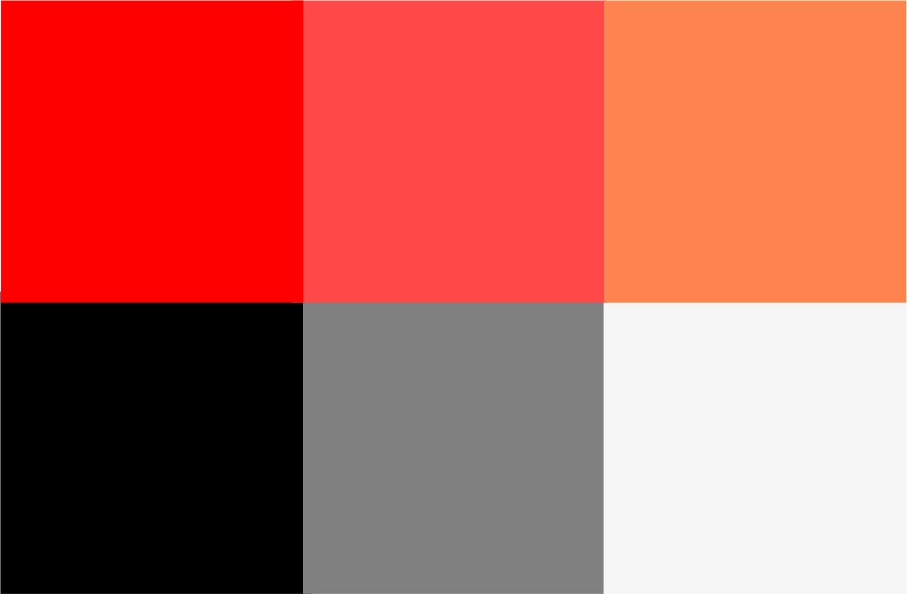

## Responsáveis gerais pelo projeto

De acordo com o processo de desenvolvimento escolhido pela equipe irão ser atribuídos quatro papéis gerais: desenvolvedor, gerente de projeto, analista de teste e redator técnico.

###

| Papel              | Atribuições                                                                                                                                | Responsável                                                   | Participantes                                                               |
| ------------------ | ------------------------------------------------------------------------------------------------------------------------------------------ | ------------------------------------------------------------- | --------------------------------------------------------------------------- |
| Gerente de Equipe  | Auxiliar a equipe a codificar o produto, codificar testes unitários, realizar refatoração                                                  | [Augusto Durães Camargo](https://github.com/augustocrmg)      | Alexia Naara, Ana Caroline, Carlos Eduardo Mesquita, Davi Gonçalves         |
| Gerente de Projeto | Responsável pela administração do projeto e por assegurar a participação ativa do cliente                                                  | [André Corrêa](https://github.com/dartmol203)                 | Augusto Durães Camargo, Arthur Ferreira, Carlos Eduardo Roriz, Gabriel Luiz |
| Analista de Teste  | Ajudar o cliente a escrever os testes de aceitação e Identificar eventuais defeitos no sistema fornecendo feedback para os desenvolvedores | [Ana Caroline](https://github.com/anaaroch)                   | Carlos Eduardo Mesquita, Alexia Naara, Davi Gonçalves                       |
| Redator Técnico    | Auxiliar a equipe de desenvolvimento a documentar o sistema                                                                                | [Arthur Ferreira](https://github.com/ArthurFerreiraRodrigues) | Alexia Naara, Carlos Eduardo Mesquita, Ana Caroline, Davi Gonçalves         |

## Planejamento das Fases e/ou Iterações do Projeto

Foi escolhido o ciclo de vida evolutivo graças ao constante feedback recebido pelo cliente em que nós vamos aos poucos implementando os requisitos do cliente à medida que são necessários. Disponível em: <a href="./ciclos.md">Ciclos</a>.

## Matriz de Comunicação

| Descrição                                                                                                               | Área/ Envolvidos                                                        | Peridicidade          | Produtos Gerados                                                                             |
| ----------------------------------------------------------------------------------------------------------------------- | ----------------------------------------------------------------------- | --------------------- | -------------------------------------------------------------------------------------------- |
| Acompanhamento das Atividades em Andamento  Acompanhamento dos Riscos, Compromissos, Ações Pendentes, Indicadores | Equipe de MDS                                Equipe de Requisitos | Semanal               | Lista de presença e tópicos importantes da reunião    Relatório de situação do projeto |
| Atualização do andamento do projeto                                                                                     | Equipe de MDS  Equipe de Requisitos   Professor             | Duas vezes por semana | Feedback para a equipe                                                                       |
| Comunicação geral com a equipe                                                                                          | Equipe de MDS               Equipe de Requisitos                  | Sempre que necessário | Feedback da equipe                                                                           |
| Reunião com o cliente                                                                                                   | Equipe de requisitos  Cliente                                     | Semanal               | Relato de satisfação    Lista de presença na reunião e tópicos importantes             |

## Ferramentas

### Discord
  
 Discord é um aplicativo gratuito de comunicação que permite que você converse por voz, vídeo e texto. O Discord pode ser usado em quase todas as plataformas e dispositivos conhecidos, incluindo Windows, macOS, Linux, iOS, iPadOS, Android, e navegadores. 

### Teams
  
 O Microsoft Teams é um software desenvolvido para controlar, organizar e desenvolver o trabalho individual ou de grandes e pequenas equipes. Ele funciona como um ambiente de trabalho virtual. É similar ao mais famoso Slack, porém com todo o suporte oferecido pela Microsoft através do Office 365. 

### WhatsApp
  
  O WhatsApp é um serviço de mensagens instantâneas baseado na nuvem. O Telegram está disponível para smartphones ou tablets, computadores e também como Aplicação web. Os usuários podem enviar mensagens e trocar fotos, vídeos, stickers e arquivos de qualquer tipo. 

  
 Para uso do projeto, o aplicativo servirá para comunicações entre os membros da equipe, dúvidas, horários, entregas, discussões e etc. 

## Identidade visual

### Cores:

<!-- 
 
-->

#### Cores principais

    

    <b>#FF834F</b>

NavBars e Headers

    

    <b>#FF4949</b>

Elementos que precisam se destacar na tela

#### Cores secundárias

    

    <b>#F6F6F6</b>

Background mais leve para os olhos

    

    <b>#FF0000</b>

Mensagens de erro e alertas em geral

    

    <b>#000000</b>

Fontes

    

    <b>#808080</b>

Textos em campos

****

### Tipografia

Para os textos da aplicação será utilizada a fonte **Montserrat**.

Os tamanhos dos textos devem seguir o padrão estabelecido:
**Titulo da página:** 24px
**Subtitulos:** 18px
**Textos em botões:** 14px
**Outros textos:** 14px

### Outros estilos definidos

Foi pré-estabelecido também o tamanho de algumas bordas que serão
utilizadas na aplicação:
**Border radius em botões** 4px
**Border radius em categorias** 15px
**Border radius em cards** 15px
**Border radius em tabela** 10px

<!-- ## Icons

Os icones utilizados na aplicação serão, por padrão, os icones do
[Material Icons](https://material.io/resources/icons/?style=baseline). -->

**Histórico de Versões**

| Data       | Versão | Descrição                               | Autor                                                         |
| ---------- | ------ | --------------------------------------- | ------------------------------------------------------------- |
| 30/06/2022 | 0.1    | Versão inicial                          | [Augusto Camargo](https://github.com/augustocrmg)             |
| 30/06/2022 | 0.1.1  | Versão inicial(identidade visual)       | [Arthur Ferreira](https://github.com/ArthurFerreiraRodrigues) |
| 01/07/2022 | 0.1.2  | adição da tabela de versões             | [André Corrêa](https://github.com/dartmol203)                 |
| 19/07/2022 | 0.2    | Atualizações para entrega unidade 2     | [André Corrêa](https://github.com/dartmol203)                 |
| 19/07/2022 | 0.3    | Remodela pagina                         | [Alexia Naara](https://github.com/alexianaa)                  |
| 21/07/2022 | 0.3.1  | pequena alteração matriz de comunicação | [André Corrêa](https://github.com/dartmol203)                 |

