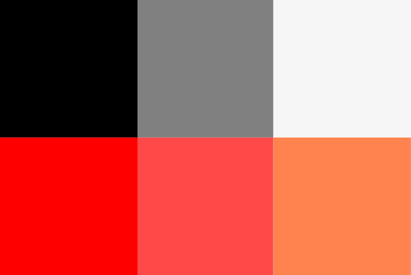
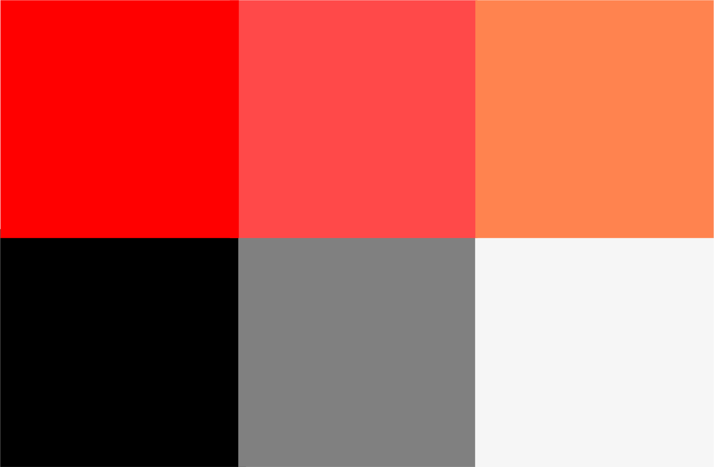

<h1 style="text-align: center">Identidade Visual</h1>

## Cores:

<!-- 
 
-->

#### Cores principais

    

    <b>#FF834F</b>

NavBars e Headers

    

    <b>#FF4949</b>

Elementos que precisam se destacar na tela

#### Cores secundárias

    

    <b>#F6F6F6</b>

Background mais leve para os olhos

    

    <b>#FF0000</b>

Mensagens de erro e alertas em geral

    

    <b>#000000</b>

Fontes

    

    <b>#808080</b>

Textos em campos

****
## Tipografia

Para os textos da aplicação será utilizada a fonte **Montserrat**.

Os tamanhos dos textos devem seguir o padrão estabelecido:
**Titulo da página:** 24px
**Subtitulos:** 18px
**Textos em botões:** 14px
**Outros textos:** 14px

## Outros estilos definidos

Foi pré-estabelecido também o tamanho de algumas bordas que serão
utilizadas na aplicação:
**Border radius em botões** 4px
**Border radius em categorias** 15px
**Border radius em cards** 15px
**Border radius em tabela** 10px

<!-- ## Icons

Os icones utilizados na aplicação serão, por padrão, os icones do
[Material Icons](https://material.io/resources/icons/?style=baseline). -->